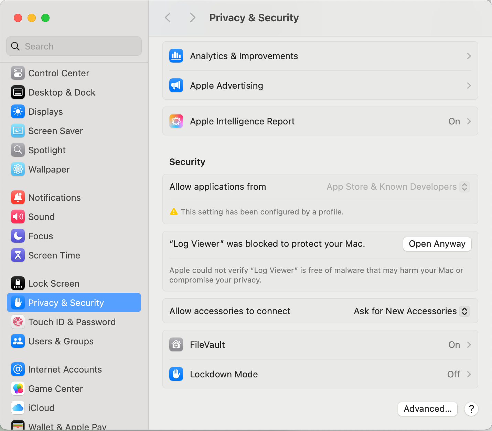

# Next-Gen Log Viewer

## Overview
Next-Gen Log Viewer is a powerful, user-friendly desktop application designed to simplify log analysis for engineers. Built with **Scala**, it transforms raw log files into a structured, easy-to-read format, significantly improving debugging efficiency.

## Features
- **Log Parsing & Structuring**: Automatically extracts key components (timestamp, log level, source, message body) from raw logs.
- **Advanced Filtering & Search**:
    - Filter by log level (INFO, WARN, ERROR, DEBUG, etc.).
    - Keyword search for quickly locating relevant logs.
    - Sort logs by timestamp.
- **User-Friendly UI**:
    - Logs displayed in a structured table format.
    - Color-coded log levels for better visibility.
    - Expandable log details for in-depth analysis.
- **File Support**:
    - Open and parse log files (.log, .txt).
    - Auto-detects log patterns and formats.

## Installation
### MacOS Application Download
For macOS users, you can download the prebuilt .dmg file:

Download "Log Viewer-1.0.dmg"

If macOS blocks you from opening the application, you can go to the Privacy & Security settings and click "Open Anyway" to bypass the warning.

Alternatively, if you prefer not to change the privacy settings, you can build the executable locally using the command below.

### Running the Application (Development Mode)
Ensure you have the following installed before proceeding:
- JDK 11 or later
- Scala & SBT installed
```sh
# To run the application from the source code, use:
sbt run
```

### Build an Application Executable
```sh
# To generate a standalone JAR file:
sbt assembly
# To package the application as a macOS .dmg, Windows .msi, or Linux .deb:
jpackage --name "Log Viewer" \
         --input target/scala-2.13/ \
         --main-jar Log-Viewer-assembly-0.1-SNAPSHOT.jar \
         --main-class sun.scalafx.LogViewerApp \
         --type dmg  # Use "msi" for Windows, "deb" for Linux
```

## How to Use
1. **Open a Log File**: Click the "Open Log File" button and select a log file.
2. **View Logs**: Logs will be displayed in a structured table format.
3. **Filter & Search**: Use the dropdown to filter logs by level or search for keywords.
4. **View Details**: Click on a log entry to see detailed information.

## Supported Log Pattern
The tool supports logs formatted with the following pattern:
- **Timestamp**: YYYY/MM/DD HH:MM:SS
- **Log Level**: e.g., INFO, ERROR, WARN
- **Source Name**: Alphanumeric with possible special characters ($, -, :)
- Optional Class Name
- Optional Context Information
- **Message**: The actual log message

## Example Log Lines:
```sh
2025/02/25 06:28:24 WARN ExampleLogger$ SomeClass.scala:144 : Failed to connect to database server.
2025/02/25 06:32:20 INFO ExampleFactory$ [traceId=abcd1234 thread=worker-2]: Cache disabled for maintenance.
```

## Contribution
We welcome contributions! Feel free to open an issue or submit a pull request.

## License
Copyright (c) 2025 littlegrasscao


